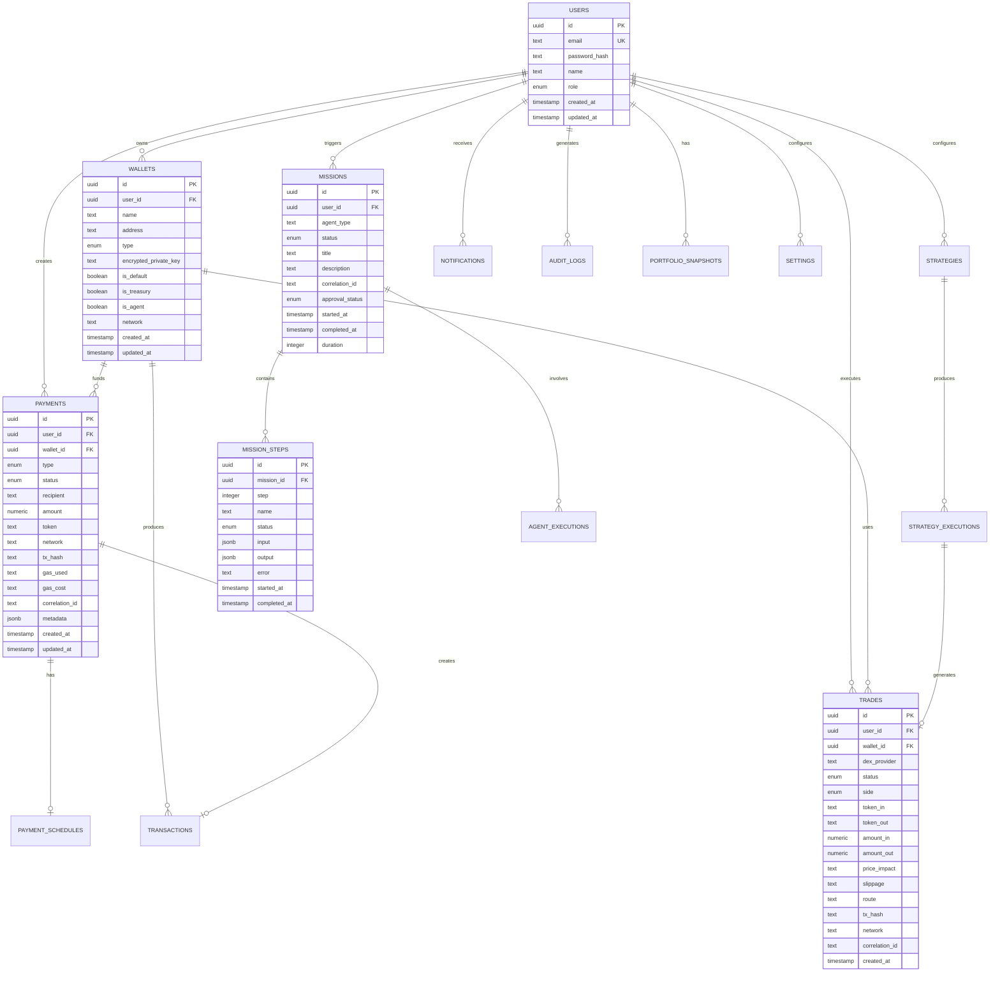

# BaseAgent OS — Architecture Overview

## System Architecture

```
┌─────────────────────────────────────────────────────────────────┐
│                        Frontend (Next.js 14)                     │
│  Dashboard │ Wallets │ Payments │ Trading │ Mission Control     │
│  Portfolio │ Strategies │ Analytics │ Settings                   │
└──────────────────────────────┬──────────────────────────────────┘
                               │ REST + WebSocket
┌──────────────────────────────┼──────────────────────────────────┐
│                    API Gateway (Fastify)                         │
│  ┌─────────┐ ┌──────────┐ ┌──────────┐ ┌────────────────────┐  │
│  │  Auth   │ │  RBAC    │ │  Rate    │ │  Audit Logging     │  │
│  │  (JWT)  │ │          │ │  Limit   │ │                    │  │
│  └─────────┘ └──────────┘ └──────────┘ └────────────────────┘  │
│  ┌─────────────────────────────────────────────────────────┐    │
│  │                    Core Services                         │    │
│  │  Wallet │ Payment │ DEX │ Mission │ Portfolio │ Risk     │    │
│  └─────────────────────────────────────────────────────────┘    │
│  ┌─────────────────────────────────────────────────────────┐    │
│  │              Background Workers (BullMQ)                 │    │
│  │  Payment Scheduler │ Strategy Executor                   │    │
│  └─────────────────────────────────────────────────────────┘    │
└──────────────────────────────┬──────────────────────────────────┘
                               │ REST
┌──────────────────────────────┼──────────────────────────────────┐
│                AI Agent Service (FastAPI + LangGraph)            │
│  ┌─────────────────────────────────────────────────────────┐    │
│  │                    Agent Manager                         │    │
│  │  Task Routing │ Health │ Retry │ Metrics │ Memory       │    │
│  └─────────────────────────────────────────────────────────┘    │
│  ┌─────────┐ ┌─────────┐ ┌─────────┐ ┌─────────┐              │
│  │ Payment │ │Treasury │ │ Trading │ │Portfolio│              │
│  │  Agent  │ │  Agent  │ │  Agent  │ │  Agent  │              │
│  └─────────┘ └─────────┘ └─────────┘ └─────────┘              │
│  ┌─────────┐ ┌─────────┐ ┌─────────┐ ┌─────────┐              │
│  │  Risk   │ │ Notify  │ │Analytics│ │Execution│              │
│  │  Agent  │ │  Agent  │ │  Agent  │ │  Agent  │              │
│  └─────────┘ └─────────┘ └─────────┘ └─────────┘              │
│  ┌─────────────────────────────────────────────────────────┐    │
│  │              LangGraph Workflows                         │    │
│  │  Planner → Validator → Risk → Simulation → Approval     │    │
│  │  → Execution → Confirmation → Analytics → Mission Ctrl  │    │
│  └─────────────────────────────────────────────────────────┘    │
│  ┌─────────────────────────────────────────────────────────┐    │
│  │              Strategy Engine                             │    │
│  │  DCA │ Recurring │ Rebalance │ TP/SL │ Limits           │    │
│  └─────────────────────────────────────────────────────────┘    │
└──────────────────────────────┬──────────────────────────────────┘
                               │
┌──────────────────────────────┼──────────────────────────────────┐
│                    Infrastructure                                │
│  ┌──────────┐  ┌──────────┐  ┌──────────────────────────────┐   │
│  │PostgreSQL│  │  Redis   │  │     Base Network (L2)        │   │
│  │ (Drizzle)│  │ (BullMQ) │  │  Mainnet │ Sepolia           │   │
│  └──────────┘  └──────────┘  └──────────────────────────────┘   │
└─────────────────────────────────────────────────────────────────┘
```

## Network Architecture

| Component | Port | Protocol |
|-----------|------|----------|
| Frontend | 3000 | HTTP/HTTPS |
| API Gateway | 3001 | HTTP/WS |
| Agent Service | 8000 | HTTP/WS |
| PostgreSQL | 5432 | TCP |
| Redis | 6379 | TCP |

## Supported Networks

| Network | Chain ID | USDC Contract |
|---------|----------|---------------|
| Base Mainnet | 8453 | 0x833589fCD6eDb6E08f4c7C32D4f71b54bdA02913 |
| Base Sepolia | 84532 | 0x036CbD53842c5426634e7929541eC2318f3dCF7e |

## DEX Integrations

| DEX | Router Contract | Type |
|-----|----------------|------|
| Uniswap V3 | 0x2626664c2603336E57B271c5C0b26F421741e481 | SwapRouter02 |
| Aerodrome | 0xcF77a3Ba9A5CA399B7c97c74d54e5b1Beb874E43 | V2 Router |
| Aerodrome SlipStream | 0xBE6D8f0d05cC4be24d5167a3eF062215bE6D18a5 | CL Router |

## Security Architecture

```
┌─────────────────────────────────────────────────────────┐
│                    Security Layers                       │
│                                                         │
│  Layer 1: Transport (HTTPS/TLS)                         │
│  Layer 2: Rate Limiting (per-IP, per-user)              │
│  Layer 3: Authentication (JWT + Refresh Tokens)         │
│  Layer 4: Authorization (RBAC: admin/operator/viewer)   │
│  Layer 5: Input Validation (Zod schemas)                │
│  Layer 6: CSRF Protection (double-submit cookie)        │
│  Layer 7: Wallet Encryption (AES-256-GCM + Argon2id)   │
│  Layer 8: Audit Logging (all mutations)                 │
│  Layer 9: Secret Management (env vars, never in code)   │
│                                                         │
│  Private keys: encrypted at rest, signing on server     │
│  Passwords: Argon2id hash (memory: 64MB, time: 3)      │
│  JWT: 15min access + 7d refresh, httpOnly cookies       │
└─────────────────────────────────────────────────────────┘
```

## Agent Workflow

Every task follows this execution pipeline:

```
User Request
     │
     ▼
┌─────────┐
│ Planner │ ── Decomposes task into steps
└────┬────┘
     ▼
┌──────────┐
│Validator │ ── Validates parameters and constraints
└────┬─────┘
     ▼
┌──────────┐
│Risk Agent│ ── Assesses risk, checks limits
└────┬─────┘
     ▼
┌───────────┐
│Simulation │ ── Dry-run via eth_call
└────┬──────┘
     ▼
┌──────────────┐
│User Approval │ ── (if required) Wait for approval
└────┬─────────┘
     ▼
┌───────────────┐
│Execution Agent│ ── Submit to blockchain
└────┬──────────┘
     ▼
┌──────────────┐
│Confirmation  │ ── Wait for tx confirmation
└────┬─────────┘
     ▼
┌───────────┐
│ Analytics │ ── Record metrics
└────┬──────┘
     ▼
┌────────────────┐
│Mission Control │ ── Update status, log
└────────────────┘
```

## Data Model (ERD)



## Deployment Architecture

```
┌──────────────────┐     ┌──────────────────────────────┐
│   Netlify CDN    │     │    Container Host             │
│                  │     │                                │
│  Next.js SSG/SSR │────▶│  ┌────────────┐  ┌────────┐  │
│  Static Assets   │     │  │ Fastify API│  │FastAPI │  │
│                  │     │  │  :3001     │  │ :8000  │  │
└──────────────────┘     │  └─────┬──────┘  └───┬────┘  │
                         │        │             │        │
                         │  ┌─────┴─────────────┴────┐  │
                         │  │  PostgreSQL │ Redis     │  │
                         │  └────────────────────────┘  │
                         └──────────────────────────────┘
```
